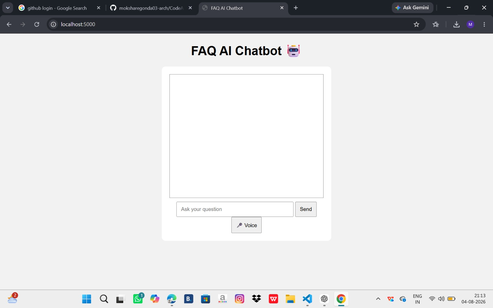
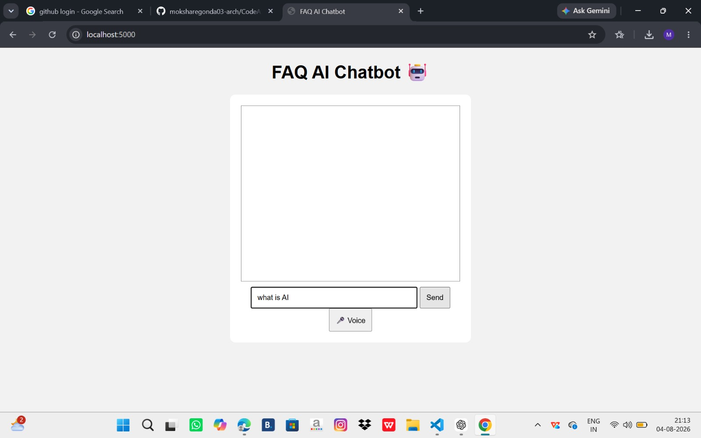
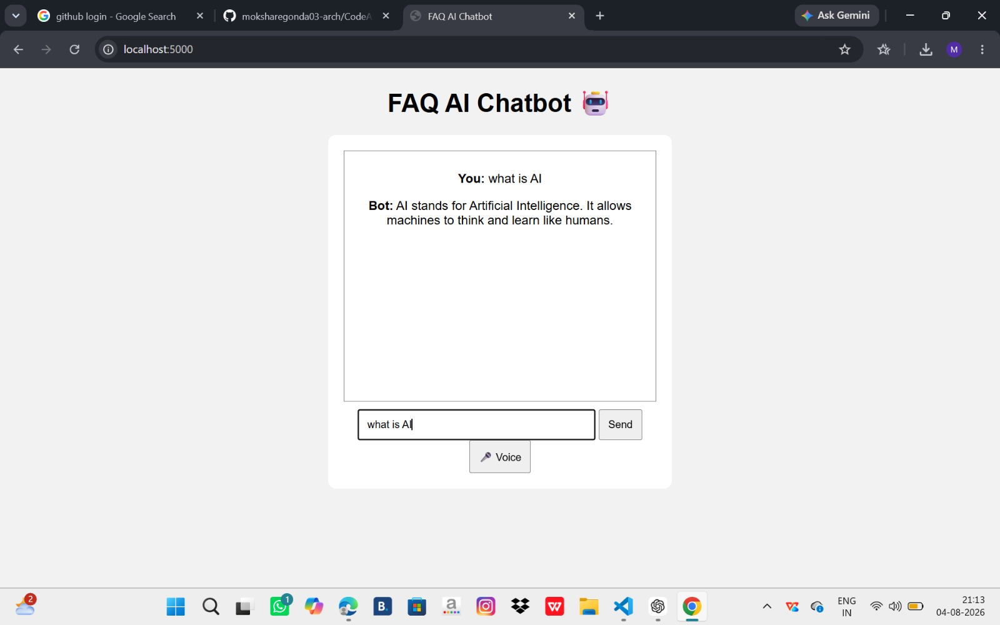

# 🤖 FAQ Chatbot

An AI-powered FAQ Chatbot built using **Python Flask and NLP techniques**.  
This chatbot understands user questions and provides relevant answers from a FAQ knowledge base. It uses NLP-based similarity matching to improve question understanding.

## 📸 Chatbot Screenshots

### Chatbot Interface

### User Question

### Chatbot Response

## 🔗 GitHub Repository

Project source code:

https://github.com/moksharegonda03-arch/CodeAlpha-FAQ-chatbot

## 👩‍💻 Author

**Moksha Regonda**